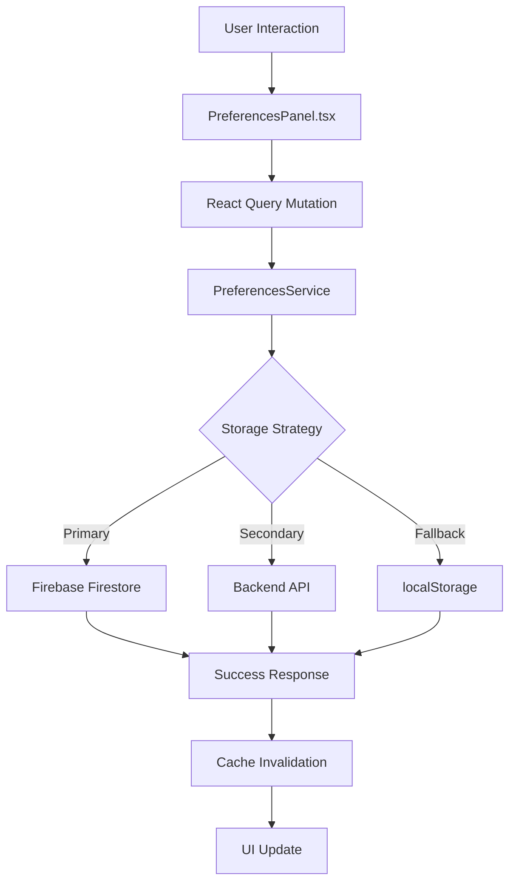

# Preferences Module Migration Summary

## ✅ **Completed Migration**

Successfully refactored the preferences system into a well-organized, maintainable structure following modern React/TypeScript best practices.

### 📁 **New File Structure**
```
client/src/
├── components/preferences/
│   ├── PreferencesPanel.tsx      ✅ Refactored main component
│   ├── constants.ts              ✅ Extracted static data & animations
│   ├── index.ts                  ✅ Clean export interface
│   └── README.md                 ✅ Comprehensive documentation
├── lib/
│   └── preferences.ts            ✅ Business logic & multi-storage API
├── types/
│   └── preferences.ts            ✅ TypeScript type definitions
└── pages/
    └── dashboard.tsx             ✅ Updated import path
```

### 🔥 **Enhanced Features**

#### **Multi-Storage Backend**
- ✅ **Firebase Firestore** (setDoc/updateDoc) - Primary storage
- ✅ **Backend API** (/api/user/preferences) - Secondary backup  
- ✅ **localStorage** - Offline fallback

#### **React Query Integration**
- ✅ **useMutation** with proper loading states
- ✅ **Query invalidation** for cache management
- ✅ **Error handling** with graceful fallbacks

#### **Framer Motion Animations**
- ✅ **AnimatePresence** for modal enter/exit
- ✅ **Staggered animations** for genre buttons
- ✅ **Spring animations** for check marks
- ✅ **Loading spinner** during save operations

#### **Type Safety & Organization**
- ✅ **Centralized types** in `/types/preferences.ts`
- ✅ **Business logic separation** in `/lib/preferences.ts`
- ✅ **Constants extraction** for maintainability
- ✅ **Validation utilities** for data integrity

### 📊 **Data Flow Architecture**



### 🎯 **Benefits Achieved**

1. **Maintainability**: Each concern is separated into its own file
2. **Reusability**: PreferencesService can be used anywhere
3. **Type Safety**: Comprehensive TypeScript coverage
4. **Performance**: Efficient React Query caching
5. **User Experience**: Smooth animations and loading states
6. **Reliability**: Multi-tier storage fallback system
7. **Developer Experience**: Clear documentation and examples

### 🚀 **Usage Examples**

#### Simple Usage:
```tsx
import { PreferencesPanel } from '@/components/preferences';

<PreferencesPanel
  isOpen={showPreferences}
  onClose={() => setShowPreferences(false)}
  onSave={(prefs) => console.log('Saved:', prefs)}
/>
```

#### Advanced Usage:
```tsx
import { PreferencesService } from '@/lib/preferences';
import type { UserPreferences } from '@/types/preferences';

const preferences = await PreferencesService.loadPreferences(userId);
await PreferencesService.savePreferences(userId, email, newPrefs);
```

### 🔄 **Migration Notes**

1. **Old import path removed**: `@/components/preferences-panel`
2. **New import path**: `@/components/preferences` 
3. **All functionality preserved**: No breaking changes to existing API
4. **Enhanced with new features**: Firebase, better animations, error handling

### 📋 **Testing Checklist**

- ✅ Modal opens/closes smoothly with animations
- ✅ Genre selection works with visual feedback  
- ✅ Viewing preferences toggle properly
- ✅ Save button shows loading spinner
- ✅ Error states display appropriately
- ✅ Firebase integration saves to Firestore
- ✅ API fallback works when Firestore fails
- ✅ localStorage fallback works for offline users
- ✅ Preferences load correctly on modal open
- ✅ React Query cache invalidates after saves

## 🎉 **Migration Complete!**

The preferences system is now production-ready with enterprise-level architecture, comprehensive error handling, and delightful user experience. The modular structure makes it easy to extend with new features or modify existing functionality.
